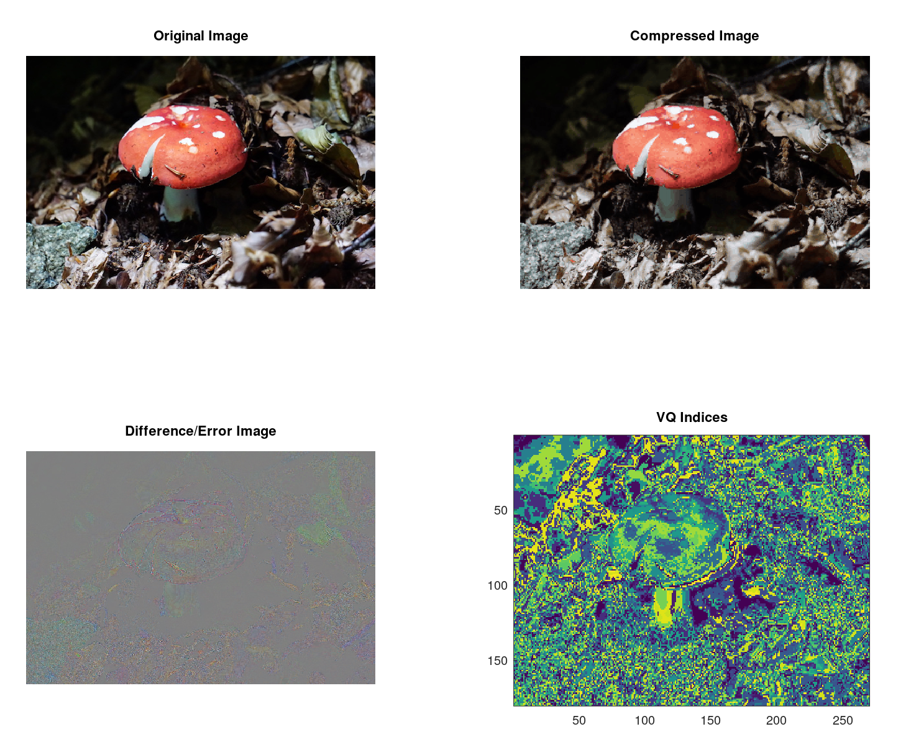

# VQToolkit

**VQToolkit** is a series of open-source MatLAB implementations of the Vector Quantization algorithms, that are GPU-accelerated, fault-tolerant, and basically free for non-commercial use. C++ implementations may follow later on to allow them to be used elsewhere.

See a usage example [here](ExampleImageVQ.m).

The example above compresses the image by building a dictionary of 256 2x2 tiles. We can calculate the compression ratio as follows:

- Original image: 540 (width) x 360 (height) x 3 (bytes per pixel) ~= 569.5KiB
- Compressed image
  - VQ Indices: 540 x 360 x 1/4 (bytes per pixel) = 47.5 KiB
  - Dictionary: 256 x 4 (2x2 pixels per block) * 3 (bytes per pixel) = 3KiB
  - Total: 50.5 KiB -> 11.2:1 compression ratio compared to original bitmap.

Not bad, considering the JPEG stored in this repository is about twice the size (though at much better image quality and compression times).

## Modes of Operation

- *Accurate*, where the generated dictionary will be close to optimal at the cost of very slow convergence time. Dictionary is built up and converged one vector/codebook entry at a time.
- *Fast*, where dictionary generation is considerably faster at the cost of optimality. Basically, the dictionary is initialized with random vectors from the dataset and iterated from there, instead of "growing out" as the *accurate* variant does.

## Benchmarks

- CPU Intel 1: Core i7 7567U (2c/4t) @ 3.5GHz, ~3.9GHz turbo
- CPU Intel 2: Core i5 3210M (2c/4t) @ 2.5GHz, ~2.9GHz turbo
- CPU ARM: Raspberry Pi 3B+ (4c/4t) @ 1.2 GHz
- GPU: Nvidia GeForce 640M (12c/384t) @ 500MHz, 2GB
- MatLAB Version: R2018a

*Precise* refers to the execution of `ExampleImageVQ`, whereas *Fast* is the same, but calling `GenVQDictFast` inside instead.

| Environment                      | Precise  |  Fast  |
| -------------------------------- |---------:|-------:|
| Intel 1, MatLAB                  |   28m20s |  6m03s |
| Intel 1, Octave 5.2.0 Homebrew   |   15m34s | 10m42s |
| Intel 2, MatLAB                  | 1h41m50s | 12m56s |
| Intel 2, Octave 4.2.2 Ubuntu/WSL |   53m28s |  7m43s |
| ARM, Octave 4.0.0 Raspbian       | 7h35m57s | 50m46s |
| GPU, MatLAB                      | 1h01m12s |  8m28s |